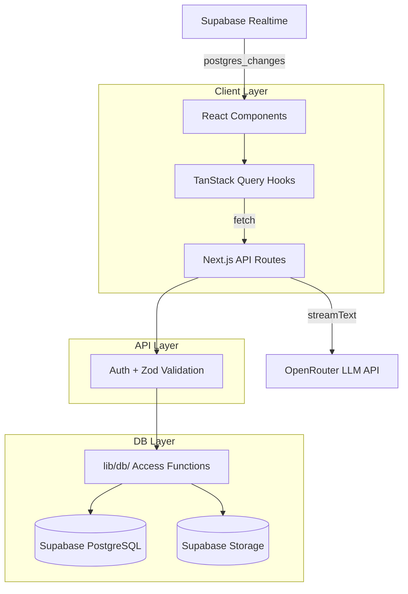

# AI Chatbot

A ChatGPT-like chatbot built with Next.js 16, Supabase, and OpenRouter. Features streaming AI responses, file attachments (images + documents), anonymous trial access, and multi-tab synchronization.

Built as a test assignment for [Paralect Product Academy](https://www.paralect.com/).

## Live Demo

- [Live Application](https://YOUR_VERCEL_URL)
- [Demo Video (Loom)](https://www.loom.com/share/YOUR_VIDEO_ID)

## Features

- **Real-time AI chat** with token-by-token SSE streaming
- **Image attachments** with AI vision analysis (clipboard paste + file upload)
- **PDF/DOCX document upload** with text extraction injected as AI context
- **Anonymous trial** -- 3 free questions without signup, tracked via browser fingerprint
- **Multi-tab chat synchronization** via Supabase Realtime
- **Dark/light theme toggle**
- **Responsive design** -- desktop sidebar + mobile Sheet overlay
- **Markdown rendering** with syntax-highlighted code blocks
- **Auto-generated chat titles** via LLM on first message

## Tech Stack

| Technology | Purpose |
|------------|---------|
| [Next.js 16](https://nextjs.org/) (App Router) | React framework with server-side rendering |
| [TypeScript](https://www.typescriptlang.org/) | Type-safe codebase |
| [Tailwind CSS 4](https://tailwindcss.com/) | Utility-first styling |
| [shadcn/ui v4](https://ui.shadcn.com/) (Base UI) | Accessible component primitives |
| [Supabase](https://supabase.com/) | PostgreSQL, Auth, Storage, Realtime |
| [AI SDK v6](https://sdk.vercel.ai/) | Streaming chat framework |
| [OpenRouter](https://openrouter.ai/) | LLM provider (free models) |
| [TanStack Query v5](https://tanstack.com/query) | Client-side data fetching and caching |

## Architecture

This project follows a **strict 3-layer separation**: Database layer, API layer, and Client layer. Zero database calls from components -- all data flows through API routes.

- **DB Layer** (`lib/db/`) -- Supabase access functions using `service_role` key (server-only)
- **API Layer** (`app/api/`) -- Next.js API routes with auth validation and Zod input schemas
- **Client Layer** (`components/`, `hooks/`) -- React components and TanStack Query hooks that fetch from API routes only

The `service_role` key is isolated in `lib/db/client.ts` and never exposed to the client. The only client-side Supabase usage is the `anon` key for Realtime subscriptions and Storage uploads.



## Getting Started

### Prerequisites

- [Node.js](https://nodejs.org/) 18+
- [pnpm](https://pnpm.io/) package manager

### Installation

```bash
# Clone the repository
git clone <repo-url>
cd <project-directory>

# Install dependencies
pnpm install
```

### Environment Variables

Copy the example environment file and fill in your values:

```bash
cp .env.example .env.local
```

| Variable | Description | Where to get it |
|----------|-------------|-----------------|
| `SUPABASE_URL` | Supabase project URL | Supabase Dashboard -> Settings -> API |
| `SUPABASE_SERVICE_ROLE_KEY` | Supabase service role key (keep secret!) | Supabase Dashboard -> Settings -> API |
| `NEXT_PUBLIC_SUPABASE_URL` | Same as SUPABASE_URL (public, for Realtime/Storage) | Same as above |
| `NEXT_PUBLIC_SUPABASE_ANON_KEY` | Supabase anon key | Supabase Dashboard -> Settings -> API |
| `OPENROUTER_API_KEY` | OpenRouter API key | [openrouter.ai/keys](https://openrouter.ai/settings/keys) |
| `SESSION_SECRET` | Secret for JWT session tokens | Generate: `openssl rand -base64 32` |

### Supabase Setup

1. Create a Supabase project at [supabase.com](https://supabase.com)
2. Run the database migrations (SQL files in `supabase/migrations/`)
3. Create the storage bucket for file attachments:
   ```sql
   INSERT INTO storage.buckets (id, name, public) VALUES ('attachments', 'attachments', true);
   ```
4. Enable Realtime on the chats table:
   ```sql
   ALTER PUBLICATION supabase_realtime ADD TABLE chats;
   ```

### Run Development Server

```bash
pnpm dev
```

Open [http://localhost:3000](http://localhost:3000) in your browser.

### Build for Production

```bash
pnpm build
pnpm start
```

## Deployment

### Vercel (Recommended)

1. Push your code to GitHub
2. Go to [vercel.com/new](https://vercel.com/new) and import the repository
3. Configure environment variables in the Vercel dashboard (all 6 variables listed above)
4. Click **Deploy** -- triggers automatically on push to `main`

### Supabase Production Config

Make sure the following are configured in your Supabase project:

- Storage bucket `attachments` exists (public)
- Realtime enabled on `chats` table

## Project Structure

```
app/
  (auth)/            # Login and signup pages
  (main)/            # Authenticated layout with sidebar
    chat/[id]/       # Individual chat page
  api/
    auth/            # Login, signup, logout, me endpoints
    chat/            # Streaming chat endpoint
    chats/           # Chat CRUD endpoints
    upload/          # File upload (signed URL + completion)
    anonymous/       # Anonymous trial chat endpoint
components/
  auth/              # Auth forms, anonymous limit dialog
  chat/              # Chat input, messages, attachments
  layout/            # Sidebar, header, theme toggle
  sidebar/           # Chat list, new chat button
  ui/                # shadcn/ui primitives
hooks/               # TanStack Query hooks (useChats, useMessages, etc.)
lib/
  ai/                # AI SDK provider config, message converter
  auth/              # Session management (JWT), auth helpers
  db/                # Supabase access functions (server-only)
  schemas/           # Zod validation schemas
  supabase/          # Public Supabase client (Realtime/Storage)
  types/             # TypeScript types, Supabase generated types
```

## License

This project was built as a test assignment for Paralect Product Academy.
